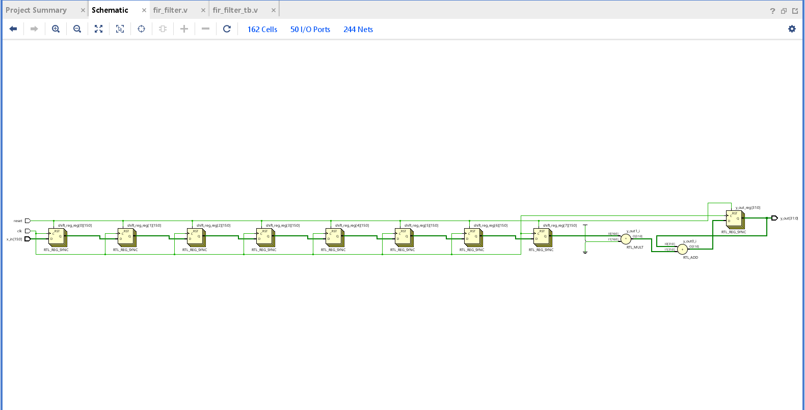
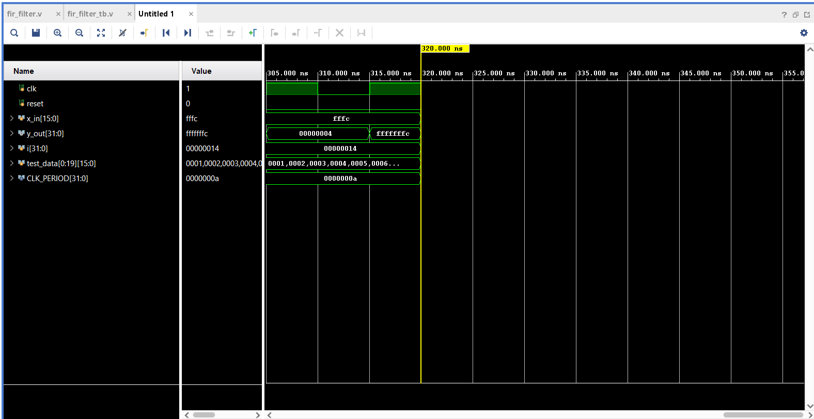

# 📉 Digital FIR Filter – Verilog | Vivado

This project implements an 8-tap Finite Impulse Response (FIR) filter using Verilog HDL in Xilinx Vivado. The FIR filter performs digital signal processing by convolving a digital input with a set of symmetric coefficients. The design is verified through waveform simulation and RTL schematic analysis.

---

## ⚙️ Features

### Parameters:
- **Number of Taps:** 8  
- **Input Width:** 16 bits  
- **Output Width:** 32 bits  
- **Coefficients:** `[2, 3, 5, 7, 7, 5, 3, 2]` (Symmetric)

### Design Elements:
- Shift Register for input sampling  
- Multiply-Accumulate (MAC) structure  
- Hardcoded coefficients  

---

## 📁 File Structure

```
FIR_Filter_Project/
├── fir_filter.v                 # Verilog FIR filter module
├── fir_filter_tb.v             # Testbench for FIR filter
├── README.md                   # Documentation
└── images/
    ├── fir_filter_rtl.png         # RTL schematic diagram (Vivado)
    └── fir_filter_waveform.png   # Simulation waveform
```

---

## 🧪 Simulation

The testbench feeds sample inputs to the FIR filter and verifies the filtered output. The waveform confirms correct convolution behavior using the predefined coefficients.

- **Input:** Series of 16-bit values  
- **Output:** Filtered 32-bit values (`y_out`)  

**Waveform:**  
Shows `x_in` (input samples) and `y_out` (filtered output).

---

## 🖼️ RTL Schematic

Visualizes internal structure including shift registers, multipliers, and adders.



---

## 🖥️ Simulation Output

Displays convolution results for sample inputs and verifies MAC operations.



---

## 🚀 How to Run

1. Open Vivado and create a new project.
2. Add `fir_filter.v` and `fir_filter_tb.v` as source and simulation files.
3. Run Behavioral Simulation.
4. View waveform output and RTL schematic under **Tools > Schematic**.

---

## 📜 License

This project is open-source and free to use for academic and learning purposes.
